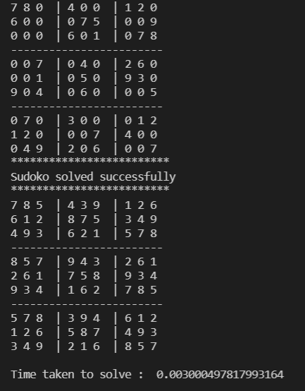

# Sudoku-Using-Backtracking
Sudoku game implementation using backtracking algorithm.
In this backtracing algorithm is used to solve the sudoku. Instaed of naive method recursion is used which is faster than the naive method.
Output of the program is 

